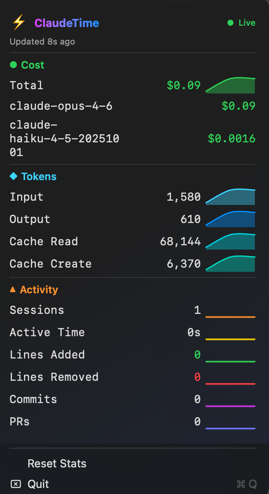

# ClaudeTime

A macOS menu bar app that receives [OpenTelemetry](https://opentelemetry.io/) metrics from [Claude Code](https://docs.anthropic.com/en/docs/claude-code) and displays a live dashboard of cost, token usage, and coding activity.



## Features

- Lives in the macOS menu bar — no dock icon
- Real-time token counts shown in the menu bar (input/output)
- Expandable dashboard with sparkline graphs for every metric
- Tracks cost per model, token breakdown, sessions, active time, lines of code, commits, and PRs
- Handles counter resets when Claude Code restarts
- Zero configuration once environment variables are set

## Requirements

- macOS 13+
- Swift 5.9+
- [Claude Code](https://docs.anthropic.com/en/docs/claude-code) with telemetry enabled

## Quick Start

1. **Set the required environment variables** (add to your shell profile):

   ```bash
   export CLAUDE_CODE_ENABLE_TELEMETRY=1
   export OTEL_METRICS_EXPORTER=otlp
   export OTEL_EXPORTER_OTLP_PROTOCOL=http/json
   export OTEL_EXPORTER_OTLP_ENDPOINT=http://localhost:4318
   export OTEL_METRIC_EXPORT_INTERVAL=10000
   ```

2. **Build and run:**

   ```bash
   swift run
   ```

3. Use Claude Code normally. Metrics will appear in the menu bar within a few seconds.

## Building from Source

```bash
# Debug build
make build

# Release build
make release

# Build .app bundle (release)
make app
# → dist/ClaudeTime.app

# Build .dmg installer
make dmg
# → dist/ClaudeTime.dmg

# Run directly
make run

# Clean build artifacts
make clean
```

## Configuration

All configuration is done via environment variables set in the shell where Claude Code runs:

| Variable | Value | Purpose |
|---|---|---|
| `CLAUDE_CODE_ENABLE_TELEMETRY` | `1` | Enable Claude Code telemetry |
| `OTEL_METRICS_EXPORTER` | `otlp` | Use OTLP exporter |
| `OTEL_EXPORTER_OTLP_PROTOCOL` | `http/json` | JSON over HTTP transport |
| `OTEL_EXPORTER_OTLP_ENDPOINT` | `http://localhost:4318` | ClaudeTime's OTLP receiver |
| `OTEL_METRIC_EXPORT_INTERVAL` | `10000` | Export interval in ms (10s) |

## How It Works

ClaudeTime runs a lightweight HTTP server on `127.0.0.1:4318` that accepts OTLP/HTTP JSON metric exports. Claude Code's built-in OpenTelemetry SDK pushes cumulative counters to this endpoint. The app parses each payload, updates its internal metric store (with counter-reset detection), and refreshes the menu bar display and sparkline history.

## Project Structure

```
Sources/ClaudeTime/
  main.swift          App entry point
  AppDelegate.swift   Menu bar setup and NSMenuDelegate
  MetricsStore.swift  Cumulative counters, time-series buffers, metric store
  DashboardView.swift SwiftUI dashboard and sparkline view
  OTLPServer.swift    HTTP server and OTLP JSON parser
  Formatters.swift    Number/cost/time formatting helpers
Resources/
  Info.plist          App bundle metadata (LSUIElement, bundle ID, etc.)
```

## License

MIT
